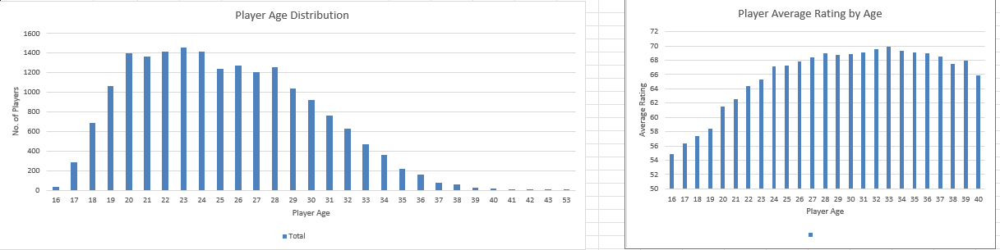
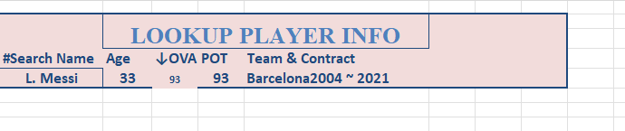

# ⚽ FIFA Player Data Analysis Project

## 📌 Project Overview

This project analyzes FIFA player data to uncover insights about player performance, potential, market value, and positional strengths. It also features an interactive Excel dashboard that allows users to search and explore player data dynamically.

---

## ❓ Problem Statement

FIFA datasets contain valuable player information, but raw data is often inconsistent and difficult to analyze. This project focuses on cleaning and transforming the data into a structured format and building an interactive tool for easy exploration and insight generation.

---

## 🎯 Objectives

* Clean and preprocess raw FIFA player data
* Convert financial data (Value, Wage) into numeric format
* Analyze player ratings, potential, and value
* Identify top players and young talents
* Build an interactive Excel dashboard with player search functionality

---

## 🛠️ Tools & Technologies

* **Excel** → Data cleaning & interactive dashboard (XLOOKUP)
* **Python (Pandas)** → Data preprocessing and analysis
* **SQL (SQLite)** → Data querying and aggregation
* **Git & GitHub** → Version control and project sharing

---

## 🧹 Data Cleaning & Preparation

* Standardized column names and formats
* Converted `Value` and `Wage` from text (e.g., €100M, €50K) into numeric values
* Cleaned and transformed the `Hits` column
* Handled missing values in key fields
* Removed duplicate records

---

## 📊 Dashboard Preview

### 🔹 Main Dashboard



### 🔹 Player Search (XLOOKUP Feature)



---

## 📈 Key Insights

* **Top Players:** Highest-rated players dominate attacking and midfield positions.

* **Young Talent:** Players under 23 with high potential represent future stars and high investment value.

* **Value vs Performance:** Player market value strongly correlates with overall rating and potential.

* **Position Analysis:** Certain positions consistently show higher average ratings, indicating role importance.

* **Player Popularity:** The `Hits` metric reflects player visibility and engagement.

---

## 🗂️ Project Structure

```id="fifastruct02"
fifa-analysis/
│
├── data/
│ ├── raw_fifa.csv
│ └── cleaned_fifa.csv
│
├── fifa.db
├── analysis.sql
├── analysis.py
├── excel_dashboard.xlsx
├── images/
│ ├── dashboard.png
│ └── XLookup_dashboard.png
└── README.md
```

---

## 🚀 How to Use This Project

1. Open the dataset from the `data/` folder
2. Run `analysis.py` for data cleaning and processing
3. Execute queries in `analysis.sql` using SQLite
4. Explore the Excel dashboard for interactive analysis

---

## 📈 Future Improvements

* Add advanced player comparison features
* Build a web-based interactive dashboard
* Integrate predictive analysis for player valuation

---

## 💡 Key Takeaway

This project demonstrates how raw sports data can be transformed into a structured, interactive, and insight-driven analysis tool using Excel, Python, and SQL.
